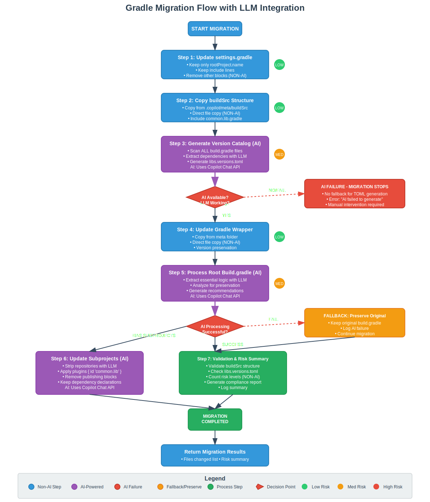

# Gradle Migration Automator

Automates migration of Gradle projects from Nexus OSS to JFrog Artifactory leveraging Git, Gradle parsing, and transformation planning. Built as a VS Code extension using Copilot’s Agent Mode and custom ChatParticipants.

## Features
- Command: `Migrate Gradle Project to Artifactory`
- Inputs: Git URL, base branch, commit message
- Workflow orchestration with three chat participants:
  - `gitAgent`: clone, branch, commit, push
  - `gradleParser`: parse Gradle build files into normalized JSON
  - `transformationPlanner`: generate unified diff patches to replace Nexus configs with Artifactory equivalents
- Intermediate artifacts stored in `.copilot/meta`
- Progress via notifications and Output Channel
- Uses VS Code's terminal for Gradle task execution (manual by user)

## Migration Flow

The migration process follows a structured 5-step approach that preserves existing build files while modernizing the Gradle configuration:



**Key Steps:**
1. **Settings.gradle Update** - Simplify to essential project structure
2. **BuildSrc Creation** - Add modern build conventions
3. **Version Catalog Generation** - Centralize dependency management
4. **File Preservation** - Keep existing build.gradle and versions.gradle files
5. **Subproject Updates** - Apply modern plugin conventions

For detailed step-by-step documentation, see [PROMPT.md](./PROMPT.md).

## Requirements
- Git installed and available in PATH
- VS Code 1.93+ (Chat Participants API)
- GitHub Copilot extension (for AI-enhanced generation)

## Workspace Handling
The extension intelligently handles different workspace scenarios:

- **Empty workspace**: Clones directly into the current directory
- **Existing git repository**: Uses the current repository and creates a migration branch
- **Non-empty workspace**: Automatically clones into `workspace/<repo-name>/` subdirectory to avoid conflicts

This means you can run the migration from any VS Code workspace without worrying about directory conflicts.

## AI Model Configuration

The extension automatically detects and uses the best available Copilot model:

**Model Priority (Auto-Selection):**
1. **GPT-4.1** (gpt-4o) - Preferred for enhanced accuracy
2. **GPT-4.0** (gpt-4) - Fallback option
3. Other available models

**Available Models:**
When the extension runs, it will log available models in the Output Channel:
```
[transformationPlanner] Available models:
  1. Copilot (GPT-4o) (GPT-4.1) - copilot-gpt-4o
  2. Copilot (GPT-4) (GPT-4.0) - copilot-gpt-4
```

**Manual Model Selection:**
You can explicitly set your preferred model by calling:
```typescript
// In your extension code or via Copilot Chat
transformationPlanner.setPreferredModel('gpt-4o'); // For GPT-4.1
// or
transformationPlanner.setPreferredModel('gpt-4');  // For GPT-4.0
```

## How It Works

```
+----------------------+       +------------------+       +---------------------------+       +------------------+
|      gitAgent        |  -->  |   gradleParser   |  -->  |   transformationPlanner   |  -->  |     gitAgent     |
| - clone & branch     |       | - parse Gradle   |       | - create unified diffs    |       | - apply & push   |
| - commit & push      |       | - emit JSON AST  |       | - classify risks          |       |                  |
+----------------------+       +------------------+       +---------------------------+       +------------------+
```

Artifacts:
- `.copilot/meta/gitAgent.json` – repo, branch, workspace path
- `.copilot/meta/gradle-ast.json` – normalized Gradle model
- `.copilot/meta/patches.diff` – unified diffs to apply
- `.copilot/meta/planner.json` – files changed and risk summary

## Usage
1. Open VS Code.
2. Run `Migrate Gradle Project to Artifactory` from the command palette.
3. Provide Git URL, base branch, and commit message.
4. The extension clones the repo, parses Gradle files, generates patches, applies, commits, and pushes to a feature branch.
5. Next steps:
   - Use the VS Code terminal to run Gradle tasks, e.g. `./gradlew clean build publish`.
   - Open a PR with the migration branch.

## Safety & Permissions
- `gitAgent`: network + file I/O + runCommands (git CLI)
- `gradleParser`: read-only file access
- `transformationPlanner`: local compute + read/write workspace

## Development
- `npm install`
- `npm run compile`
- Press F5 to launch an Extension Development Host.

## Notes
- The Artifactory URL is a placeholder (`https://artifactory.example.com/artifactory/libs-release`). Update to match your environment.
- Patch application uses `git apply`. Ensure working tree is clean before running.